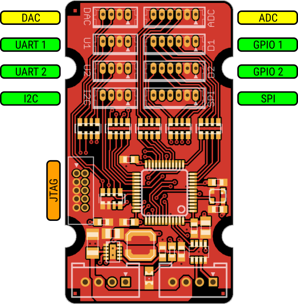

[[io-module]]
= IO module

[[description]]
Integrate existing hardware into the real-time Nova Core bus with analog and digital signals.

[[layout]]
== Layout

[[specifications]]
== Specifications

.Microcontroller
include::../common/stm32f303_specs.adoc[]

.Interfaces
- 2x GPIO ports
- 2x UART ports
- 1x I2C port
- 1x SPI port
- 1x ADC port (12 bit, 0-3.3 V)
- 1x DAC port (12 bit, 0-3.3 V)

[[voltage_ratings]]
== Voltage Ratings

.Recommended Operating Conditions
[width="100%",cols="<50%,^20%,^10%,^10%,^10%",frame="topbot",options="header"]
|================
|Parameter            |Symbol |MIN | MAX |Units
|Bus supply voltage   |Vbus   |5   | 48  |V
|================

.Absolute Maximum Ratings
[width="100%",cols="<50%,^20%,^20%,^10%",frame="topbot",options="header"]
|================
|Parameter            |Symbol |Rating |Units
|Bus supply voltage   |Vbus   |0 to 60 |V
|Total current output |Iport  |200     |mA
|================

[[pinout]]
== Pinout

.ADC port (ADC)
include::../common/adc_pinout.adoc[]

.GPIO 1 port (D1)
include::../common/gpio_pinout.adoc[]

.GPIO 2 port (D2)
include::../common/gpio_pinout.adoc[]

.UART 1 port (U1)
include::../common/uart_pinout.adoc[]

.UART 2 port (U2)
include::../common/uart_pinout.adoc[]

.I2C port (I2C)
include::../common/i2c_pinout.adoc[]

.SPI port (SPI)
include::../common/spi_pinout.adoc[]

.DAC port (DAC)
include::../common/dac_pinout.adoc[]

.Core Bus
include::../common/core_bus_pinout.adoc[]

.JTAG/SWD
include::../common/jtag_pinout.adoc[]
