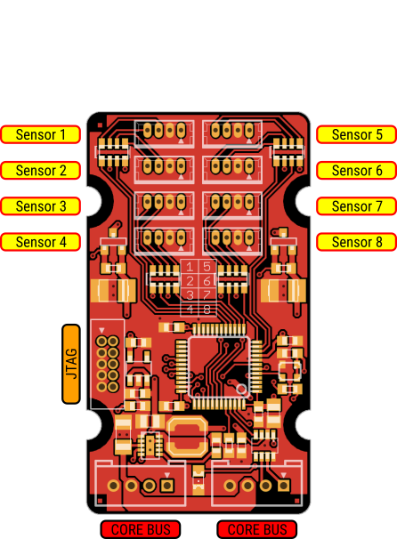

[[io-module]]
= IO module

[[description]]
Enables robots to sense and avoid obstacles with up to 8 proximity sensors.

[[layout]]
== Layout

[[specifications]]
== Specifications

.Microcontroller
include::../common/stm32f303_specs.adoc[]

.Interfaces
The module can interface with infrared and ultrasonic proximity sensors providing analog or digital measurements.
Analog measurements can vary from 0 to 3.3 V.
Digital measurements are acquired by reading the duration of the high or low part of a PWM signal.

[[voltage_ratings]]
== Voltage Ratings

.Recommended Operating Conditions
[width="100%",cols="<50%,^20%,^10%,^10%,^10%",frame="topbot",options="header"]
|================
|Parameter            |Symbol |MIN | MAX |Units
|Bus supply voltage   |Vbus   |5   | 48  |V
|================

.Absolute Maximum Ratings
[width="100%",cols="<50%,^20%,^20%,^10%",frame="topbot",options="header"]
|================
|Parameter            |Symbol |Rating |Units
|Bus supply voltage   |Vbus   |0 to 60 |V
|Total current output |Iport  |200     |mA
|================

[[pinout]]
== Pinout

.Proximity port (P1-P8)
include::../common/proximity_pinout.adoc[]

.Core Bus
include::../common/core_bus_pinout.adoc[]

.JTAG/SWD
include::../common/jtag_pinout.adoc[]
