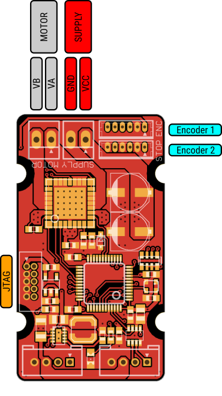

[[udc-module]]
= uDC module

[[description]]
Drives motors up to 70 W, with torque, speed, and position closed loop control.

[[layout]]
== Layout

[[specifications]]
== Specifications

.Microcontroller
include::../common/stm32f303_specs.adoc[]

.H-bridge
include::../common/mc33826_specs.adoc[]

[[voltage_ratings]]
== Voltage Ratings

.Recommended Operating Conditions
[width="100%",cols="<50%,^20%,^10%,^10%,^10%",frame="topbot",options="header"]
|================
|Parameter            |Symbol |MIN | MAX |Units
|Bus supply voltage   |Vbus   |5   | 48  |V
|Motor supply voltage |Vmot   |5   | 24  |V
|================

.Absolute Maximum Ratings
[width="100%",cols="<50%m,^20%,^20%,^10%",frame="topbot",options="header"]
|================
|Parameter            |Symbol |Rating |Units
|Bus supply voltage   |Vbus   |0 to 60 |V
|Motor supply voltage |Vmot   |0 to 28 |V
|================

[[pinout]]
== Pinout

.Encoder 1
The encoder 1 interface allows to connect position / speed encoders with digital quadrature output or analog output.

The encoder 1 port connector is a 6-pin 1.25mm Molex Picoblade (PN 53047-06).

.Encoder 1 pinout
include::../common/encoder_pinout.adoc[]

.Encoder 2
The encoder 2 interface allows to connect position / speed encoders with digital quadrature output or analog output.
The encoder 2 can also be used as SPI interface to integrate additional devices.

The encoder 2 port connector is a 6-pin 1.25mm Molex Picoblade (PN 53047-06).

.Encoder 2 pinout (Encoder mode)
include::../common/encoder_pinout.adoc[]

.Encoder 2 pinout (SPI mode)
include::../common/spi_pinout.adoc[]

=== Core bus
.Core bus pinout
include::../common/core_bus_pinout.adoc[]

=== Debugging interface
.JTAG/SWD pinout
include::../common/jtag_pinout.adoc[]
