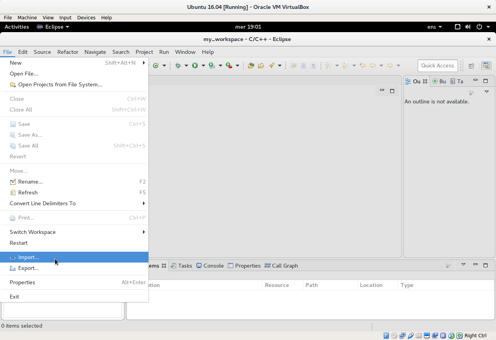
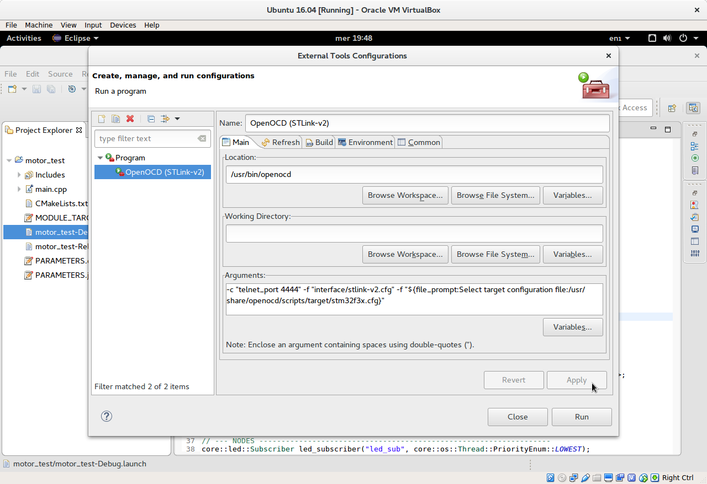

[[tutorial-eclipse]]
== Setting up the Eclipse IDE

[[tutorial-eclipse-overview]]
=== Overview
In this tutorial we will learn how to install and configure Eclipse to program and debug Core targets.

[[tutorial-eclipse-installation]]
=== Step I: installation

Download the latest "Eclipse IDE for C/C++ Developers" release from the Eclipse link:https://www.eclipse.org/downloads/eclipse-packages/[website].

image::img/eclipse_download.png[Layout, 800, align="center"]

Extract the archive content in a folder of your choice, for example ~/core-sdk/eclipse.

[[tutorial-eclipse-plugins]]
=== Step II: additional plugins

To work with embedded targets Eclipse needs a plugin which interfaces to OpenOCD, the JTAG debugger.

This plugin is called "GDB Hardware" and can be installed with the Eclipse software manager.

Start Eclipse and clic on the Help menu to select "Install New Software..."

From the "Work with" dropdown menu select "CDT - ..." as Software Site, and wait for Eclipse to download the available packages (it takes about one minute).

Then search for "gdb" and wait for Eclipse looking for it (it takes some time again).

Finally flag the "C/C++ GDB Hardware Debugging" package in the "CDT Optional Features" group and start the installation by clicking "Next".

During the installation process you will be asked to agree with the License and at the end Eclipse will restart.

[[tutorial-eclipse-import]]
=== Step III: import projects

Eclipse is now ready to import the projects generated by the `CoreWorkspace.py` command in the previous tutorials.

To import projects, select the "File" menu and clic on "Import...".

In the import window, select "Existing Projects into Workspace" in the "General" group.

In the "Select root directory" field clic "Browse" and select the `src` directory inside your workspace.

You will see one Eclipse project for each target in the workspace, flag the ones you want to import.

[[tutorial-eclipse-build]]
=== Step IV: build targets

Eclipse is now ready to build the projects we imported.

First of all, select the "motor_test" project and open the "main.cpp" source file.

TIP: You may notice that several lines are underlined in red/yellow by Eclipse, because it has to index source files from the Core distribution. Don't worry, this will be solved by the very first build!

Now clic on the hammer icon and select "Debug" or "Release" to build the corresponding firmware

[[tutorial-eclipse-openocd]]
=== Step V: setup OpenOCD

The last step before flashing and running the firmware is to setup OpenOCD, the program which acts as interface between the JTAG probe hardware and GDB, the GNU Debugger.

To setup OpenOCD, clic on the "External tools" icon and select "External Tools Configurations..."

Now clic add a new launch configuration, call it "OpenOCD (STLink-v2)" and enter the openocd executable location (it is usually located under `/usr/bin/openocd`) and copy and paste the following line in the "Arguments" field.

=================
[listing.console]
-c "telnet_port 4444" -f "interface/stlink-v2.cfg" -f "${file_prompt:Select target configuration file:/usr/share/openocd/scripts/target/stm32f3x.cfg}"
=================

These arguments tell OpenOCD to use the STLink-v2 as interface (modify it if you use another JTAG probe) and opens a window popup to select the target microcontroller (the default is STM32F3).

Finally, clic on the "External tools" icon and select "OpenOCD (STLink-v2)", then select stm32f3x.cfg as target configuration.

In the console window you will see the output of OpenOCD, telling us that it found an STM32 microcontroller.

[[tutorial-eclipse-run]]
=== Step VI: flash and run the firmware

We are now ready to flash and run the firmware.

From the "Debug" icon select "motor_test-Debug" to flash the debug build, or "motor_test-Release" to flash the release build.

Eclipse will change perspective, showing the debug layout, and as soon as the firmware is flashed (it take some seconds) it will open the main.cpp file at its entry point (the beginning of the main() function).

Clic on the "Resume" icon to start the firmware.

[[tutorial-eclipse-debug]]
=== Step VII: debug the firmware

TODO

